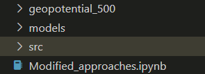

1.) The download link to the zip file containing the data needed for replicating my models is located [here](https://dataserv.ub.tum.de/index.php/s/m1524895?path=%2F5.625deg%2Fgeopotential_500)  
&emsp;a) In order to run properly, the zip file should be extracted into a folder that is saved in the same location as the modified approaches file, with the name 'geopotential_500'  
2.) The file containing my new approaches is titled "Modified_approaches.ipynb"  
3.) The src folder is necessary for computing MSE & RMSE so it will need to be downloaded as well  

